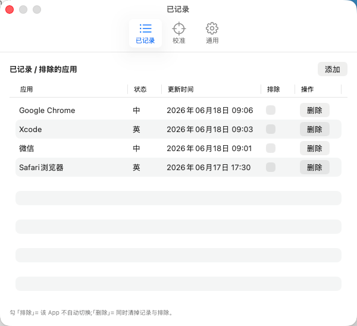

# IMEmory（输入定格）

> 按 App 记住中/英输入状态，回到该 App 时自动用**输入法内 Shift** 切回——始终在输入法里切，不切到 ABC 英文键盘。

在微信里习惯打中文、在终端/IDE 里习惯打英文，但 macOS 只记「上一次」的全局状态，每次切 App 都得手动按 Shift。IMEmory 替你记住每个 App 的偏好并自动切回，常驻菜单栏。

<p align="center">
  
</p>

## 功能

- 按 App 自动记忆 / 恢复中英状态
- 菜单栏实时显示当前中/英（`中` / `英`，缺权限或未校准时显示 `?`）
- 可视化校准向导（支持多输入法，浅/深色各一套模板）
- 已记录列表：删除、排除、手动添加排除
- 一键暂停 / 恢复自动切换、开机自启
- 屏幕捕获被系统掐断时自动重启自愈

## 下载使用

下载请前往前往[Releases](https://github.com/doubly-yi/IMEmory/releases) 

## 环境要求

- macOS 14 及以上
- 一个用 **Shift 切换中英** 的第三方中文输入法（豆包 / 搜狗 / 微信输入法等）
- 构建需要 [XcodeGen](https://github.com/yonaskolb/XcodeGen)、Xcode、一个 Apple 开发者账号（免费账号即可，用于本机签名）

## 编译安装

```bash
brew install xcodegen                 # 仅首次
export DEVELOPMENT_TEAM=你的TeamID     # 在 developer.apple.com 账号 Membership 页可查（10 位字符）
./scripts/build-and-install.sh        # 构建并安装到 /Applications/输入定格.app
```

装好后到**系统设置 › 隐私与安全性**里开两个权限：

- **屏幕录制**：截取输入法 HUD 小窗像素，识别当前中/英
- **辅助功能**：合成 Shift 键切换语言、检测文本焦点

## 使用注意

- **输入法必须开启「Shift 切换中英文」**——IMEmory 正是靠模拟这个键工作的；用其他快捷键切换的输入法不支持。
- 首次使用、或新增/更换输入法后，先到**设置 › 校准**跑一遍向导（教程序认识该输入法的中/英 HUD 长什么样），浅色和深色各校一次。
- 删除某 App 的记录 = 不再自动切换它；勾「排除」= 保留记录但暂停自动切换。

## 许可证

MIT © 2026 Doubly
